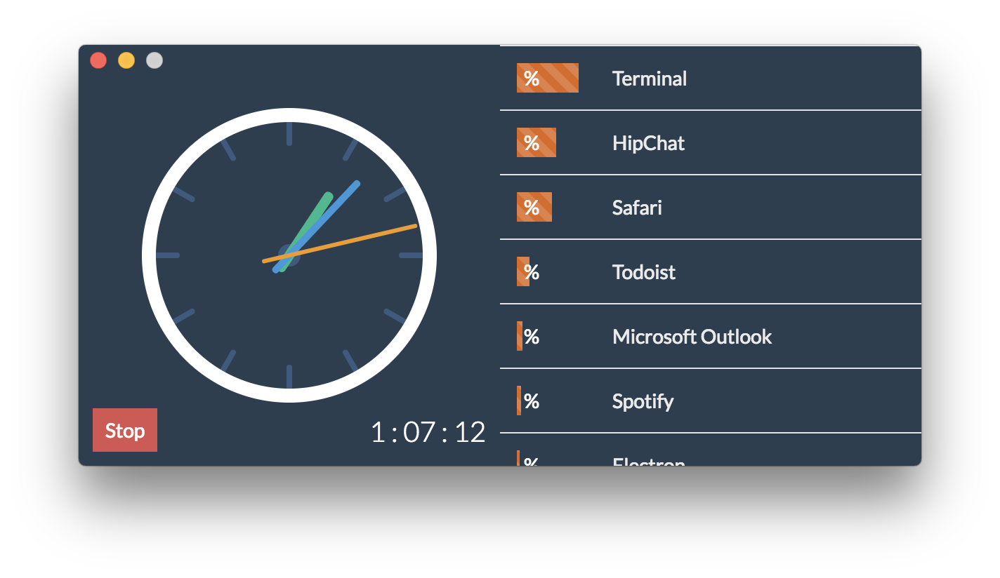

# Activity Timer

This started as a project to integrate [Todoist](https://todoist.com) with the Pomodoro method.
In my setup, I have everything categorized into projects
and labeled with either `@easy`, `@medium`, `@hard` or `@heroic`.
I wanted the visibility to see how much time I spent on different projects,
as well as the relative time I spent on different task difficulties.

I had never worked with [Electron](https://electronjs.org)
before, so I created this as an intermediate goal.
In the future, I want to revisit the original project.

I used Mithril.js to manage the components, and d3 to
manage timers and the creation of vector graphics.
The code is a bit messy right now because my main goal was functionality, not maintainability.
For instance, I should be using `d3.range([0, 12])` for the hour markers on the stopwatch.
At the time I was rushing too much to look up the API documentation
for it, so I just brute forced the solution for the time being.

